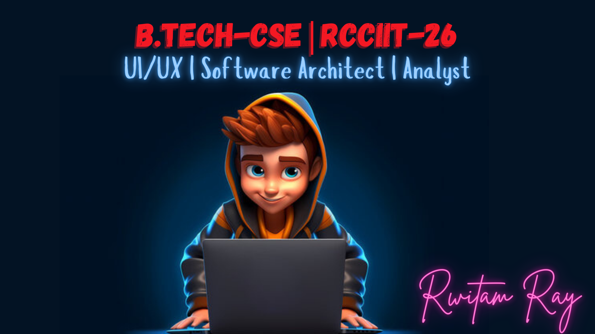

# Hola 👋 It's Rwitam here! #
# 💫 About Me:
Hey there, I'm Rwitam Ray, a free mind wannabe on a journey to solve problems for a cause and to craft exiciting applications with some exceptional user interfaces.

- 👀 I’m interested in Cyber , Robotics & Lots of Real World Problems
- 🌱 I’m currently learning Blockchain & Flutter
- 📫 How to reach me: Dm me on my socials down below
- 😄 Pronouns: He/him
- ⚡ Fun fact: Being a mad wannabe i am great chirping house with amazing listening abilities(🤫)

---

# ⚠️ Repository Information:
Most of my repositories are private. 🔒

---

# 🚀 Hackathon Highlights
  **SMART BENGAL HACKATHON (RCC IIT, Kolkata)**  
**May 2024** 

- Participated in the **Smart Bengal Hackathon** organized by RCC IIT, Kolkata.
- Spearheaded my team, NovaByte, to secure **1st Runners-Up** place in the hackathon.
- Developed our project "Saakhi" dedicatedly to enhance **women's safety**. Through a meticulously tailored map and an intuitive SOS system, where we're committed to providing a comprehensive solution to address this crucial issue.

---

# 🌐 Socials:
   

---

# 💻 Tech Stack:
                       

---

# 📈 GitHub Stats

  

---

### ✍️ Dev Quote

